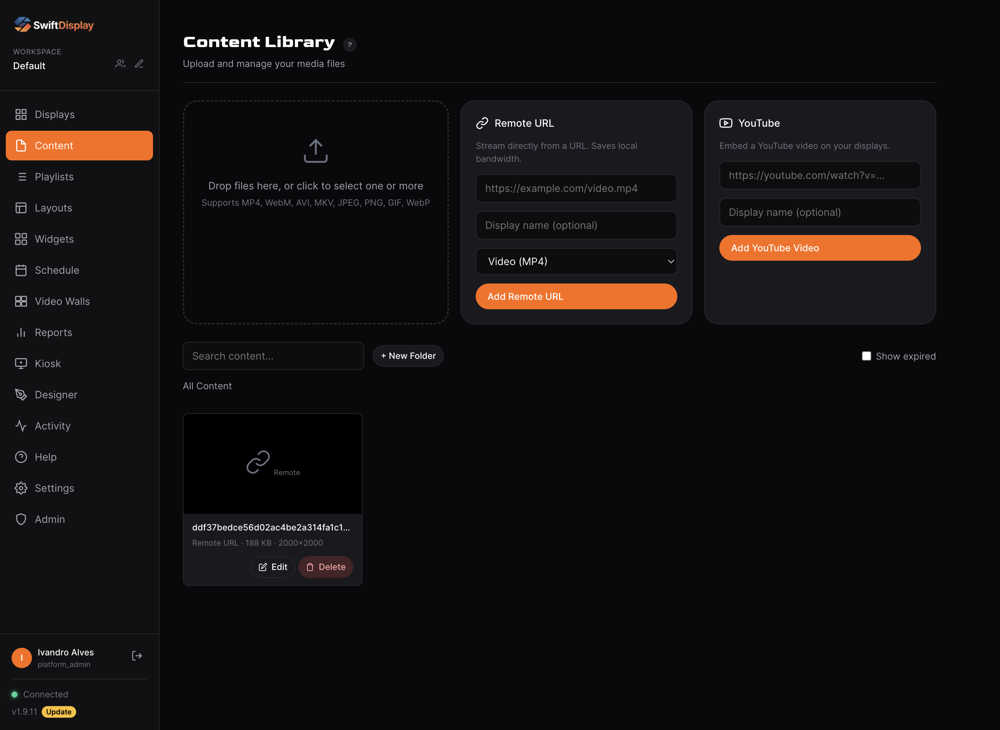

# ScreenTinker — Open-Source, Self-Hosted Digital Signage Software

<p align="center">
  
</p>

<p align="center">
  <a href="https://screentinker.com">Live demo</a> ·
  <a href="https://screentinker.com/docs">API reference</a> ·
  <a href="https://screentinker.com/guides/self-hosted-digital-signage.html">Self-hosting guide</a> ·
  <a href="https://discord.gg/utTdsrqq4Z">Discord</a>
</p>

ScreenTinker is a free, open-source **digital signage CMS** you can self-host on your own server — or run in our managed cloud. Manage TVs, video walls, and kiosks across multiple locations from one dashboard, with remote control, scheduling, playlists, and analytics. Built for retail, QSR menu boards, offices, lobbies, education, and any environment where you need centralized control over remote screens. Multi-tenant, MIT-licensed, single-developer maintained with direct contact access.

**Runs on any screen** — Android TV, Fire TV, Samsung Tizen, LG webOS, Amazon Vega OS, Raspberry Pi, Windows, ChromeOS, or any web browser. No per-device player licence, no hardware lock-in.

**Why self-host?** Keep your content and data on your own infrastructure, avoid per-screen SaaS fees, run air-gapped on a private LAN, and read or fork the source. Set `SELF_HOSTED=true` and a $5 VPS drives hundreds of screens.

**Hosted version:** [screentinker.com](https://screentinker.com) — free tier available, no credit card required.
**Guides:** [What is digital signage?](https://screentinker.com/guides/what-is-digital-signage.html) · [Open-source digital signage](https://screentinker.com/guides/open-source-digital-signage.html) · [Self-hosting guide](https://screentinker.com/guides/self-hosted-digital-signage.html)
**Community:** [Discord](https://discord.gg/utTdsrqq4Z)

## Features

- **Playlists** — first-class playlist objects: create, reorder, set per-item duration, share one playlist across multiple displays; draft/publish workflow with revert-to-published
- **Device groups** — organize displays into groups, assign a playlist to an entire group, send bulk commands (reboot, screen on/off, launch, update, shutdown), schedule content group-wide
- **Multi-zone layouts** — split screens into zones with drag-and-drop editor; 7 built-in templates (fullscreen, split, L-bar, PiP, grid)
- **Video walls** — combine multiple displays into one screen with bezel compensation, device rotation, and leader-based sync
- **Remote control** — live view, touch injection, key input, power on/off
- **Scheduling** — visual weekly calendar with recurrence rules (daily/weekly/monthly), priority-based conflict resolution, both device-level and group-level schedules (device-level overrides win over group-level), timezone support
- **Widgets** — clocks, weather, RSS tickers, text/HTML, webpages, social feeds, and Directory Board (scrolling lobby tenant/room/staff directories with dark/light themes, category management, and anti-burn-in motion)
- **Kiosk mode** — interactive touchscreen interfaces
- **Proof-of-play** — per-content and per-device analytics, hourly/daily breakdowns, CSV export for ad verification
- **Device telemetry** — battery, storage, RAM, CPU, WiFi signal strength, and uptime reported by Android players
- **Offline resilience** — both web and Android players keep displaying cached content during server or internet outages (Android ContentCache, web player Service Worker); state syncs when connectivity returns
- **Mobile-responsive** — full management dashboard and landing page work on phones and tablets
- **Workspaces** — multi-tenant data model: organizations contain workspaces, workspaces contain devices/content/playlists/schedules; users can be members of multiple workspaces and switch via a dropdown in the sidebar
- **Member roles** — six-level hierarchy (platform_admin / org_owner / org_admin / workspace_admin / workspace_editor / workspace_viewer) gated at every API route
- **Alerts** — email notifications via Microsoft Graph when devices go offline; built-in spam protection (2h dedup, 24h long-offline cutoff, sequential send pattern); per-user opt-out via Settings → Account
- **White-label** — custom branding, colors, logo, favicon, CSS, and domain
- **Content management** — folder organization, remote URL content (no upload needed), YouTube embeds, video duration detection via ffprobe, automatic thumbnail generation, Unicode-safe filenames (NFC normalization + UTF-8 multipart decoding)
- **Export/Import** — v2 format with playlists, device groups, schedules, and optional media bundling (ZIP); backward-compatible v1 import with automatic playlist migration
- **Device authentication** — per-device tokens for secure WebSocket connections; devices authenticate on every reconnect
- **Account management** — in-app password change, profile editing, email-based password reset
- **Security** — JWT auth, bcrypt hashing, parameterized SQL, rate-limited endpoints, per-user ownership checks on all resources, ongoing auth/IDOR/XSS audits
- **Built-in billing** — Stripe integration for SaaS subscriptions (optional)
- **Auto-update** — OTA updates pushed to devices automatically
- **Activity log** — full audit trail of user and system actions

## Architecture

### Multi-tenancy model

Three nested primitives:

```
organizations (billing + branding container)
   workspaces  (resource scope: devices, content, playlists, schedules, walls, layouts, widgets, groups)
      members (users with a role on that workspace)
```

Every resource (device, content row, playlist, schedule, etc.) carries a `workspace_id`. Every API route filters by it. Cross-workspace access requires switching workspaces via the sidebar dropdown — there are no magic role-based "see everything" bypasses on individual resource routes.

### Role hierarchy

Six roles, top wins:

| Role | Scope | Cap |
|---|---|---|
| `platform_admin` | every workspace in the system | full read/write (via acting-as on workspaces they're not a direct member of) |
| `org_owner` | one organization | billing + delete + admin within all workspaces in the org |
| `org_admin` | one organization | admin within all workspaces in the org (no billing) |
| `workspace_admin` | one workspace | manage members, rename, full read/write |
| `workspace_editor` | one workspace | create/edit content, devices, playlists, schedules; no member changes |
| `workspace_viewer` | one workspace | read-only |

### Workspace switcher

Users who are members of more than one workspace see a dropdown in the sidebar header. Switching mints a fresh JWT with the new `current_workspace_id` claim and reloads the page. Platform admins see every workspace in the system.

### Auto-migration on boot

Schema migrations run automatically the first time the server starts after a git pull. **Self-hosters never need to run a manual migration command.** On detecting a pre-multi-tenancy database, the server takes a timestamped snapshot (`server/db/remote_display.pre-migration-<timestamp>.db`), runs the Phase 1 migration (creates `organizations` / `workspaces` / `workspace_members` tables, backfills `workspace_id` on every resource, one auto-created Default workspace per existing user), then continues startup. If the migration fails the server prints the restore command and exits.

### Data flow

- **Android / web players** → device-namespace WebSocket → server. Authenticated per-device with a long-lived device token. Each device joins a room keyed on its `device_id`.
- **Admin dashboard** → dashboard-namespace WebSocket → server. Authenticated with the user's JWT. Each socket joins one room per accessible workspace so outbound events (device status, screenshots, playback progress) only reach dashboards that should see them.
- **Admin REST** → `/api/*` HTTPS → Express → SQLite. Everything scoped by `workspace_id` from JWT `current_workspace_id` claim.
- **Email** → pluggable transport (`EMAIL_TRANSPORT`): Microsoft Graph `sendMail` via client-credentials OAuth (in-memory token cache) **or** SMTP via nodemailer. Sequential send pattern through alert backlogs to respect per-app concurrency limits.

## Supported Platforms

Android TV, Fire TV, Raspberry Pi, Windows, ChromeOS, LG webOS, Samsung Tizen, and any device with a web browser.

## Self-Hosting

### Requirements

- Node.js **20.6+** (the npm scripts use the built-in `--env-file-if-exists` flag, added in 20.6)
- Linux, macOS, or Windows
- SQLite (bundled via `better-sqlite3`; no separate install needed — `npm install` handles the native bindings)

### Quick Start

```bash
git clone https://github.com/screentinker/screentinker.git
cd screentinker/server
npm install
SELF_HOSTED=true npm start
```

The server starts on port 3001 (HTTP). If SSL certificates are present in `server/certs/`, it starts on port 3443 (HTTPS) with automatic HTTP-to-HTTPS redirect. Open the URL shown in the startup banner. The first registered user gets full access with all features unlocked.

Schema migrations run automatically on first boot — no manual migration commands at any point in the lifecycle.

`npm start` is preferred over `node server.js` directly because the script invokes Node with `--env-file-if-exists=.env` so a `server/.env` file (gitignored) is loaded automatically for local dev.

### Environment Variables

| Variable | Description | Default |
|----------|-------------|---------|
| `PORT` | HTTP port | `3001` |
| `HTTPS_PORT` | HTTPS port (used when SSL certs are present) | `3443` |
| `NODE_ENV` | Runtime env (`production` enables Express production optimizations + stricter error handling) | _(none)_ |
| `SELF_HOSTED` | First user gets all features unlocked | `false` |
| `HIDE_BILLING` | Hide the Subscription nav item + billing view; `#/billing` redirects to the dashboard (UI-only, opt-in) | `false` |
| `DISABLE_REGISTRATION` | Block new account creation (including OAuth auto-signup). First-user setup on an empty DB is still allowed. | `false` |
| `DISABLE_HOMEPAGE` | Redirect `/` to `/app` instead of serving the marketing landing page. For internal-only self-hosted deployments. | `false` |
| `APP_URL` | Your public URL (used for Stripe callbacks and invite-accept URLs in emailed invites) | _(none)_ |
| `JWT_SECRET` | JWT signing key (auto-generated if not set) | _(auto)_ |
| `SSL_CERT` | Path to SSL certificate | `server/certs/cert.pem` |
| `SSL_KEY` | Path to SSL private key | `server/certs/key.pem` |
| `PING_INTERVAL` | Socket.IO Engine.IO ping interval (ms). Raise for slow TV WebKits that miss pongs under decode load. | `30000` |
| `PING_TIMEOUT` | Socket.IO Engine.IO pong wait (ms). Lower = faster dead-socket detection; higher = more forgiving of laggy clients. | `30000` |
| `HEARTBEAT_INTERVAL` | App-level offline-checker frequency (ms). How often the server sweeps the device list looking for stale heartbeats. | `10000` |
| `HEARTBEAT_TIMEOUT` | How long without an app-level heartbeat (ms) before marking a device offline. Raise for slow/jittery networks. | `45000` |
| `COMMAND_QUEUE_TTL_MS` | How long the server holds commands and playlist-updates for a device that's offline at emit time (ms). Flushed in order on reconnect within this window; dropped past TTL. | `30000` |
| `DEFAULT_ADMIN_PASSWORD` | Force the initial admin user to use this password instead of a randomly generated one when the database is created. | _(random)_ |

### Troubleshooting: Database Loss / Admin Reset

If you find that your admin account is deleted or reset on every restart/commit, **this is not an authentication bug**. It means your deployment environment is deleting the local SQLite database file (`server/data/app.db`) between runs.

- The database (`server/data/app.db`) is intentionally ignored in `.gitignore`.
- If your host provides a volatile filesystem (like Heroku or some Docker setups without mounted volumes) or if you run `git clean` frequently, the database will be destroyed.
- **Solution for Development:** Define `DEFAULT_ADMIN_PASSWORD=your_password` in `server/.env` so that when the database is inevitably recreated, you don't have to check the terminal logs for the random password.
- **Solution for Production:** Ensure the `server/data/` folder is mounted to a persistent volume, or regularly back up `server/data/app.db`.

### Optional Integrations

All integrations are optional. The app works fully without any of them.

#### AI Content Design (local or cloud)

The Content Designer can turn a prompt into a finished sign — layout + copy from
an LLM, and optional background/foreground imagery from an image model. Each
workspace brings its own **OpenAI-compatible** endpoints (cloud, or fully local
and free via Ollama + stable-diffusion.cpp). See
**[docs/local-ai-setup.md](docs/local-ai-setup.md)**.

#### Stripe (Billing)

If you want to charge your users, plug in your own Stripe keys. Without them, all features are free for all users.

1. Create a [Stripe account](https://stripe.com)
2. Create products/prices for each plan in the Stripe dashboard
3. Set up a webhook endpoint pointing to `https://yourdomain.com/api/stripe/webhook` with these events:
   - `checkout.session.completed`
   - `customer.subscription.updated`
   - `customer.subscription.deleted`
   - `invoice.payment_failed`
4. Update the `plans` table in the SQLite DB with your Stripe price IDs:
   ```sql
   UPDATE plans SET stripe_price_monthly = 'price_xxx', stripe_price_yearly = 'price_yyy' WHERE id = 'starter';
   ```
5. Set the environment variables:

| Variable | Description |
|----------|-------------|
| `STRIPE_SECRET_KEY` | Your Stripe secret key (`sk_live_...` or `sk_test_...`) |
| `STRIPE_WEBHOOK_SECRET` | Webhook signing secret (`whsec_...`) |
| `APP_URL` | Your public URL (e.g. `https://signage.yourcompany.com`) |

The default plans are: Free (2 devices), Starter (8 devices), Pro (25 devices), and Enterprise (unlimited). Edit the `plans` table to change pricing, limits, or add/remove tiers. In self-hosted mode, the first user gets Enterprise automatically.

#### Google OAuth

Let users sign in with Google.

1. Create a project in [Google Cloud Console](https://console.cloud.google.com)
2. Enable the Google Identity API
3. Create OAuth 2.0 credentials (web application)
4. Add `https://yourdomain.com` as an authorized origin

| Variable | Description |
|----------|-------------|
| `GOOGLE_CLIENT_ID` | Your Google OAuth client ID |

#### Microsoft OAuth

Let users sign in with Microsoft/Azure AD.

1. Register an app in [Azure Portal](https://portal.azure.com/#blade/Microsoft_AAD_RegisteredApps)
2. Add a web redirect URI: `https://yourdomain.com`
3. Note the Application (client) ID

| Variable | Description |
|----------|-------------|
| `MICROSOFT_CLIENT_ID` | Your Azure AD application client ID |
| `MICROSOFT_TENANT_ID` | Tenant ID (`common` for multi-tenant) |

#### Email (Microsoft Graph or SMTP)

Email powers offline alerts, welcome/signup mail, admin notifications, and password reset. Two interchangeable transports are supported, selected by `EMAIL_TRANSPORT`:

| Variable | Description | Default |
|----------|-------------|---------|
| `EMAIL_TRANSPORT` | `graph` (Microsoft Graph) or `smtp` (any mail server) | `graph` |

Configure the variables for whichever transport you pick (below). If the selected transport is left blank, email is disabled and delivery is logged to stdout instead. If it is **partially** configured (some fields set, others missing), the server logs a clear `[EMAIL] … MISCONFIGURED — missing: …` error at startup.

##### Option A — Microsoft Graph (`EMAIL_TRANSPORT=graph`, default)

Microsoft Graph `Mail.Send` via the client-credentials flow. Best if you already run Microsoft 365 / Azure.

| Variable | Description |
|----------|-------------|
| `GRAPH_TENANT_ID` | Microsoft Azure AD tenant ID |
| `GRAPH_CLIENT_ID` | Azure AD app registration client ID |
| `GRAPH_CLIENT_SECRET` | Azure AD app registration client secret |
| `GRAPH_SENDER_EMAIL` | Mailbox to send from (must be a valid mailbox or alias in the tenant) |
| `GRAPH_SENDER_NAME` | Display name shown in the email `From` field (defaults to `ScreenTinker`) |

**Azure AD app setup:**

1. Register a new app in Azure AD (single-tenant)
2. Under **API permissions**, add an **Application** permission: Microsoft Graph → `Mail.Send`
3. Click **Grant admin consent** for the tenant
4. Under **Certificates & secrets**, generate a new **Client secret** and capture the value (it is only shown once)
5. Capture the **Directory (tenant) ID** and **Application (client) ID** from the Overview page
6. Set the five env vars above in your deployment (systemd unit, `.env` file, etc.)

##### Option B — SMTP (`EMAIL_TRANSPORT=smtp`)

Send via any standard mail server (Postfix, Gmail, Mailgun, SendGrid, a corporate relay, …) using [nodemailer](https://nodemailer.com). Ideal for self-hosters without an Azure/M365 setup.

| Variable | Description | Default |
|----------|-------------|---------|
| `SMTP_HOST` | Mail server hostname (e.g. `mail.example.com`) | _(required)_ |
| `SMTP_PORT` | Port — `587` for STARTTLS, `465` for implicit TLS | _(required)_ |
| `SMTP_SECURE` | `true` = implicit TLS (465); `false` = STARTTLS (587) | `false` |
| `SMTP_USER` | Auth username. Omit (with `SMTP_PASSWORD`) for an unauthenticated relay | _(none)_ |
| `SMTP_PASSWORD` | Auth password. Required **if** `SMTP_USER` is set | _(none)_ |
| `SMTP_FROM` | From address — `Name <addr@example.com>` or `addr@example.com` | _(required; falls back to `SMTP_USER`)_ |

Example (Gmail app password):

```
EMAIL_TRANSPORT=smtp
SMTP_HOST=smtp.gmail.com
SMTP_PORT=587
SMTP_SECURE=false
SMTP_USER=you@gmail.com
SMTP_PASSWORD=your-app-password
SMTP_FROM=ScreenTinker <you@gmail.com>
```

The Docker image bundles nodemailer, so no extra steps are needed for a self-hosted container — just set the `SMTP_*` vars in your `env_file` / compose `environment`.

**Local dev fallback:** if the selected transport is unconfigured (e.g. no `GRAPH_*`, or no `SMTP_*`), `sendEmail()` short-circuits and logs `[EMAIL] not configured - would send to ...` to stdout instead of sending. The app keeps running normally; only delivery is suppressed. A minimal local-dev install with no mail access works fine — email-triggering features just won't deliver anything externally.

**Dev safety allow-list:**

| Variable | Description |
|----------|-------------|
| `GRAPH_DEV_RESTRICT_TO` | Comma-separated allow-list of recipient emails (applies to **both** transports). When set, sends to addresses **not** in the list are suppressed (logged but never delivered). |

Use this in local dev when running against a fresh production database clone to prevent accidental emails to real users. Leave it **unset in production** so emails flow to everyone normally.

**Alert spam protections** (also live, no configuration needed):
- **2-hour dedup window** per (alert-type, target-id) pair — the same device won't trigger repeated alerts within two hours
- **24-hour long-offline cutoff** — devices that have been offline for more than 24 hours stop generating alerts (the user already knows or the device is abandoned; further alerts are noise)
- **Sequential send pattern** through the offline-alert backlog — avoids Graph's per-app concurrent-send throttling (HTTP 429 `ApplicationThrottled`)
- **Per-user opt-out** via the `email_alerts` toggle in Settings → Account; respects user preference before any Graph call

### Production Deployment

> [!WARNING]
> **Native Compilation Restriction**
> ScreenTinker intentionally avoids using `better-sqlite3` and relies exclusively on `libsql` for SQLite connections. `better-sqlite3` requires compiling from source via `node-gyp` if a matching prebuilt binary is not found, which fails on many shared hosting environments (like cPanel/CloudLinux) that lack a C/C++ compiler (`make`). `libsql` uses cross-platform Rust binaries via optional dependencies, guaranteeing installation success without needing root access to install build tools. **Do not introduce native C/C++ dependencies unless they guarantee fallback-free prebuilds.**

For production, put the app behind a reverse proxy (nginx, Caddy, etc.) with SSL:

```bash
# Create a dedicated user
sudo useradd -r -s /bin/false screentinker

# Copy the app
sudo cp -r . /opt/screentinker
sudo chown -R screentinker:screentinker /opt/screentinker

# Install dependencies
cd /opt/screentinker/server && npm install --production

# Create a systemd service
sudo cat > /etc/systemd/system/screentinker.service << 'EOF'
[Unit]
Description=ScreenTinker
After=network.target

[Service]
Type=simple
User=screentinker
WorkingDirectory=/opt/screentinker/server
ExecStart=/usr/bin/node server.js
Restart=always
Environment=PORT=3001
Environment=NODE_ENV=production
Environment=SELF_HOSTED=true
# Lock down an internal / provisioned-only instance (all accounts created by your
# team). DISABLE_REGISTRATION closes self-service signup — first-user setup on an
# empty DB is still allowed, and the login page hides its "Create account" button
# to match. DISABLE_HOMEPAGE sends `/` straight to the app instead of the
# marketing landing page.
# Environment=DISABLE_REGISTRATION=true
# Environment=DISABLE_HOMEPAGE=true
# Environment=APP_URL=https://signage.yourcompany.com
# Environment=STRIPE_SECRET_KEY=sk_live_...
# Environment=STRIPE_WEBHOOK_SECRET=whsec_...
# Email alerts via Microsoft Graph - see Email Alerts section above for setup
# Environment=GRAPH_TENANT_ID=...
# Environment=GRAPH_CLIENT_ID=...
# Environment=GRAPH_CLIENT_SECRET=...
# Environment=GRAPH_SENDER_EMAIL=support@yourcompany.com
# Environment=GRAPH_SENDER_NAME=Your Brand

[Install]
WantedBy=multi-user.target
EOF

sudo systemctl enable --now screentinker
```

#### Nginx Example

```nginx
server {
    listen 80;
    server_name signage.yourcompany.com;
    return 301 https://$host$request_uri;
}

server {
    listen 443 ssl http2;
    server_name signage.yourcompany.com;

    ssl_certificate /path/to/cert.pem;
    ssl_certificate_key /path/to/key.pem;

    client_max_body_size 500M;

    location / {
        proxy_pass http://127.0.0.1:3001;
        proxy_http_version 1.1;
        proxy_set_header Upgrade $http_upgrade;
        proxy_set_header Connection "upgrade";
        proxy_set_header Host $host;
        proxy_set_header X-Real-IP $remote_addr;
        proxy_set_header X-Forwarded-For $proxy_add_x_forwarded_for;
        proxy_set_header X-Forwarded-Proto $scheme;
        proxy_read_timeout 86400;
    }
}
```

### Updating

To update a running instance to the latest version:

```bash
cd /opt/screentinker

# Upgrade to the latest tagged release. Backs up the db (a .backup snapshot under
# ./backups), checks out the tag, runs npm ci --omit=dev, restarts the service,
# and reports the running version.
scripts/upgrade.sh

# ...or pin a specific release:
scripts/upgrade.sh v1.8.0
```

Set `SERVICE_NAME` if your systemd unit is not named `screentinker`.

If you deployed without git, initialize it once so `upgrade.sh` can resolve tags:

```bash
cd /opt/screentinker
git init
git remote add origin https://github.com/screentinker/screentinker.git
git fetch origin --tags
git checkout -f main
cd server && npm install --production
sudo systemctl restart screentinker
```

**Track bleeding edge (`main`)** instead of tagged releases - newest code, less tested:

```bash
cd /opt/screentinker && git checkout main && git pull origin main
cd server && npm install --production && sudo systemctl restart screentinker
```

Your database, uploads, and configuration are preserved — only code files are updated.

**Schema migrations run automatically.** No manual migration commands at any point. On detecting a database that hasn't been through Phase 1 multi-tenancy migration yet, the server takes a timestamped snapshot first (`server/db/remote_display.pre-migration-<timestamp>.db`) and only continues startup once migration commits cleanly. If migration fails, the server logs the snapshot's path and exits — restore it with `cp` and investigate before retrying.

### Backups

The SQLite database is at `server/db/remote_display.db` and uploaded content is in
`server/uploads/`. For a one-off DB copy (safe while the server runs):

```bash
sqlite3 server/db/remote_display.db ".backup /path/to/backup.db"
```

**Recommended: nightly automated backups** via `scripts/backup.sh`. It takes an
atomic DB snapshot plus a hard-linked, point-in-time copy of your content (durable
images/videos; ephemeral per-device screenshots are excluded), with daily + monthly
retention and an error log. Add a cron entry:

```bash
# as root (or your service user) — adjust the path to your install
0 3 * * * /opt/screentinker/scripts/backup.sh
```

Override defaults with env vars if your layout differs:
`SCREENTINKER_DIR` (default `/opt/screentinker`), `BACKUP_DIR`, `DB`, `UPLOADS`,
`DAILY_KEEP` (7), `MONTHLY_KEEP` (12), `DB_KEEP_DAYS` (30). Backups land in
`$BACKUP_DIR` (`remote_display-<ts>.db`, `content-latest/`, `content-<ts>/`,
`content-monthly-<YYYYMM>/`) and each run appends to `$BACKUP_DIR/backup.log`.

### Admin Recovery

Locked out? Run this on the server to get a temporary admin token (1 hour):

```bash
node scripts/reset-admin.js
```

### Building the Android APK

The Android player app is in the `android/` directory. To build it:

```bash
cd android

# Set your keystore credentials (or generate a new keystore)
export KEYSTORE_PASSWORD=your_password
export KEY_ALIAS=your_alias
export KEY_PASSWORD=your_password

# Build the APK
./gradlew assembleDebug
```

The APK will be at `android/app/build/outputs/apk/debug/app-debug.apk`. Copy it to `server/` as `ScreenTinker.apk` to serve it from `/download/apk`:

```bash
cp android/app/build/outputs/apk/debug/app-debug.apk ScreenTinker.apk
```

> **Release builds & MDM signage (#81):** `./gradlew assembleRelease` is automatically
> re-signed to carry a **v1 (JAR) signature alongside v2/v3** (the `resignReleaseV1` task in
> `app/build.gradle.kts`). At `minSdk 26` the Gradle plugin omits v1, and some MDM-managed
> commercial displays (e.g. MAXHUB/Pivot) **strip a v2-only APK on reboot** — screens that
> power-cycle nightly then lose the app. v1+v2+v3 installs everywhere from API 19 to the
> latest Android. (`enableV1Signing = true` alone does not work at minSdk ≥ 24.)

To generate a new signing keystore:

```bash
keytool -genkey -v -keystore android/release-key.jks -keyalg RSA -keysize 2048 -validity 10000 -alias your_alias
```

**Requirements:** Java 17+, Android SDK (API 34).

### Device Setup

1. Register at your ScreenTinker instance
2. Go to **Displays** and click **Add Display**
3. Install the ScreenTinker app on your device:
   - **Android TV / tablets**: Download the APK from your instance (`/download/apk`) or build it from source (see above)
   - **Raspberry Pi**: `curl -sSL https://your-instance/scripts/raspberry-pi-setup.sh | bash`
   - **Debian 13 (headless)**: `curl -sSL https://your-instance/scripts/debian-13-setup.sh | sudo bash`
   - **Windows**: Run the setup script from `scripts/windows-setup.bat`
   - **Samsung Tizen TV / signage**: point the TV's URL Launcher (or browser) at `https://your-instance/player` - no signing needed. For an installed native app, see [tizen/README.md](tizen/README.md)
   - **Any browser**: Open `https://your-instance/player` in kiosk/fullscreen mode
4. Enter the pairing code shown on the device

> **Troubleshooting a player** (stuck on "Connecting to server", re-pointing a
> device to a different server, or connecting adb over Wi-Fi): see
> [docs/android-troubleshooting.md](docs/android-troubleshooting.md).

### For Developers

Working on ScreenTinker itself:

```bash
git clone https://github.com/screentinker/screentinker.git
cd screentinker/server
npm install
npm start          # starts in dev with --env-file-if-exists=.env
# or:
npm run dev        # same as start, plus --watch for auto-restart
```

**`.env` file (gitignored):** create `server/.env` for local configuration. Anything documented in the env var tables above works. Common starting set:

```
SELF_HOSTED=true
APP_URL=https://localhost:3443
# Optional: Microsoft Graph email config for testing real delivery
# GRAPH_TENANT_ID=...
# GRAPH_CLIENT_ID=...
# GRAPH_CLIENT_SECRET=...
# GRAPH_SENDER_EMAIL=you@yourcompany.com
# Optional: dev safety - only let these recipient emails through to Graph
# GRAPH_DEV_RESTRICT_TO=you@yourcompany.com,colleague@yourcompany.com
```

**No M365 access?** That's fine. With `GRAPH_*` env vars unset, `sendEmail()` short-circuits and logs `[EMAIL] not configured - would send to ...` to stdout. Everything else runs normally; only outbound email is suppressed. Useful for backend work that touches the email path without setting up an Azure app.

**Running against a fresh prod DB clone?** Set `GRAPH_DEV_RESTRICT_TO=your-email@example.com` to keep accidental sends from reaching real users in the cloned database. Sends to anyone outside the list are logged but never posted to Graph.

**Reporting issues:** [GitHub Issues](https://github.com/screentinker/screentinker/issues) for bugs and feature requests, or drop into [Discord](https://discord.gg/utTdsrqq4Z) for quick questions and feedback.

**Contributions welcome.** Fork → branch → PR. There are no formal style guides yet beyond what you can pick up from reading the existing code. Tests aren't required but smoke-test against your local server before opening a PR.

## Project Structure

```
server/           Node.js/Express backend
  config.js       Configuration and environment variables
  server.js       Main entry point
  db/             SQLite database, schema, and migrations
  routes/         API route handlers (devices, playlists, groups, schedules, etc.)
  middleware/     Auth (JWT + device tokens), rate limiting, file upload, sanitization
  services/       Background services (heartbeat, scheduler, alerts, activity logging)
  ws/             WebSocket handlers (device namespace + dashboard namespace)
  player/         Web-based display player
frontend/         Static SPA dashboard
  js/views/       View components (dashboard, playlists, groups, schedules, etc.)
  js/utils.js     Shared utilities (HTML escaping)
  css/            Stylesheets
  legal/          Terms, privacy, licenses
android/          Android TV/tablet player app (Kotlin, ExoPlayer)
scripts/          Device setup scripts + admin recovery
```

## Tech Stack

- **Backend:** Node.js 20.6+, Express, Socket.IO, SQLite (better-sqlite3)
- **Frontend:** Vanilla JS SPA (no framework, no build step), ES modules, Service Worker for offline support
- **Android:** Kotlin, ExoPlayer, Socket.IO client
- **Auth:** JWT with bcrypt, Google/Microsoft OAuth (optional)
- **Email:** Microsoft Graph via `@azure/msal-node` client-credentials (optional)
- **Payments:** Stripe (optional)
- **Data model:** multi-tenant — organizations contain workspaces contain resources; six-level role hierarchy gated server-side at every API route

## Support

ScreenTinker is free and MIT licensed, and it stays that way. If it's useful to you and you want to help keep development going, you can chip in:

- ⭐ Star the repo, honestly this helps more than you'd think
- 💬 Report bugs or ideas in [Discord](https://discord.gg/utTdsrqq4Z) or [issues](https://github.com/screentinker/screentinker/issues)
- ☕ [Donate via Wise](https://wise.com/pay/business/bytetinkerllc?utm_source=quick_pay) (ByteTinker LLC)

GitHub Sponsors integration is also planned. Direct contact: [dan@bytetinker.net](mailto:dan@bytetinker.net) or via Discord.

## License

[MIT](LICENSE)
